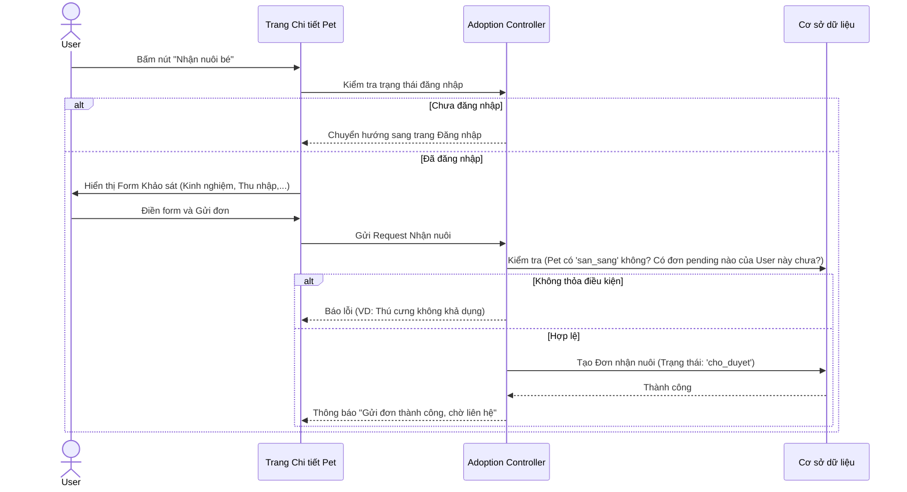
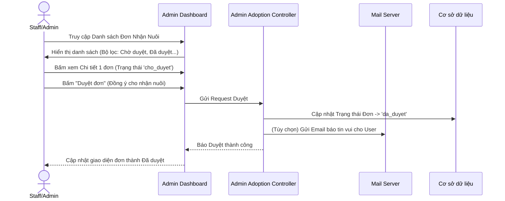
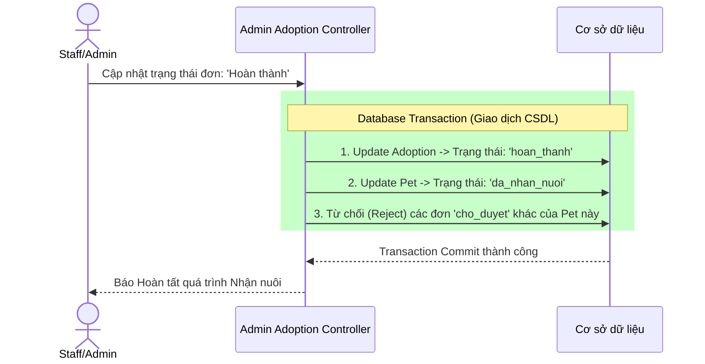

# TÀI LIỆU PHÂN TÍCH NGHIỆP VỤ
**Hệ thống:** Pet Adoption Management System (PetJam)
**Module:** Quản lý Nhận Nuôi Thú Cưng (Pet Adoption)

---

## 1. Giới thiệu Module
Module Nhận nuôi là tính năng cốt lõi (Core Feature) của hệ thống PetJam, kết nối giữa những thú cưng đang tìm mái nhà và những người dùng có nhu cầu nhận nuôi. Module bao trùm từ quá trình khách hàng nộp đơn (Frontend) cho đến khi nhân viên trung tâm xét duyệt và bàn giao thú cưng (Backend).

---

## 2. Các luồng nghiệp vụ cốt lõi (Business Flows)

### 2.1 Luồng Gửi đơn nhận nuôi (Frontend - Submit Application)
- **Nghiệp vụ:** Khách hàng (User) sau khi tìm hiểu thông tin một bé thú cưng sẽ quyết định gửi đơn xin nhận nuôi. Đơn này chứa các thông tin khảo sát về điều kiện và kinh nghiệm nuôi dưỡng để trung tâm đánh giá.
- **Quy tắc (Business Constraints):**
  - Người dùng bắt buộc phải đăng nhập mới được gửi đơn.
  - Chỉ thú cưng đang ở trạng thái **Sẵn sàng nhận nuôi** (`san_sang`) mới hiển thị nút Nhận nuôi.
  - Một người dùng không thể gửi nhiều đơn Đang chờ duyệt (`cho_duyet`) cho cùng một bé thú cưng (Chống spam).
  - **Giới hạn số lượng đơn:** Một khách hàng chỉ được phép có tối đa 3 đơn nhận nuôi đang trong quá trình xử lý (chưa hoàn tất). Nếu muốn đăng ký nhận nuôi bé thứ 4, họ phải hoàn thành hoặc hủy bớt các đơn cũ.

### 2.2 Luồng Xử lý và Xét duyệt đơn (Backend - Process Application)
- **Nghiệp vụ:** Nhân viên (Staff) hoặc Quản trị viên (Admin) truy cập trang Dashboard để quản lý danh sách các đơn nhận nuôi được gửi về.
- **Quy trình:**
  - Nhân viên xem chi tiết câu trả lời khảo sát trong đơn.
  - Gọi điện/liên hệ phỏng vấn khách hàng.
  - Quyết định **Duyệt (Approve)** hoặc **Từ chối (Reject)** đơn. Khi từ chối phải ghi rõ lý do.

### 2.3 Luồng Hoàn tất Bàn giao (Complete Adoption)
- **Nghiệp vụ:** Khách hàng đến trung tâm, ký giấy tờ và đón thú cưng về nhà. Lúc này trên hệ thống, nhân viên sẽ thao tác đánh dấu "Hoàn thành" quy trình nhận nuôi.
- **Xử lý Logic ngầm (Core Logic):**
  - Khi một đơn nhận nuôi được chuyển sang **Hoàn thành (`hoan_thanh`)**, bé thú cưng đó đã chính thức có chủ.
  - Do đó, hệ thống phải TỰ ĐỘNG chuyển trạng thái của bé thú cưng sang **Đã nhận nuôi (`da_nhan_nuoi`)**.
  - Đồng thời, nếu có những khách hàng khác cũng nộp đơn xin nhận nuôi bé đó (các đơn đang ở trạng thái 'cho_duyet'), hệ thống phải TỰ ĐỘNG chuyển các đơn kia sang **Từ chối / Hủy** vì thú cưng không còn khả dụng nữa.

### 2.4 Luồng Khách hàng Hủy đơn (Cancel Application)
- **Nghiệp vụ:** Khách hàng sau khi nộp đơn nhưng thay đổi quyết định, không thể nhận nuôi nữa. Khách có thể vào trang **"Lịch sử nhận nuôi"** của mình để chủ động Hủy đơn.
- **Quy tắc:** Chỉ được hủy khi đơn đang ở trạng thái **Chờ duyệt (`cho_duyet`)**. Nếu đơn đã được trung tâm duyệt hoặc hoàn thành thì khách không tự hủy được trên hệ thống mà phải liên hệ trực tiếp.

---

## 3. Cơ chế Kỹ thuật và Bảo mật

### 3.1 Giao dịch cơ sở dữ liệu (Database Transactions)
- **Vấn đề:** Trong "Luồng Hoàn tất Bàn giao", có tới 3 thao tác ghi vào CSDL (Cập nhật đơn hiện tại, Cập nhật thú cưng, Hủy các đơn khác). Nếu hệ thống mất điện hoặc lỗi code giữa chừng, dữ liệu sẽ bị lệch (Ví dụ: Đơn thì hoàn thành nhưng Thú cưng vẫn ở trạng thái sẵn sàng).
- **Giải pháp:** Sử dụng hàm `DB::transaction()` của Laravel. Cơ chế này đảm bảo: Nếu có 1 lỗi xảy ra, toàn bộ các lệnh cập nhật trước đó trong block transaction sẽ bị quay lui (Rollback). Chỉ khi cả 3 thao tác đều thành công thì mới được lưu vĩnh viễn (Commit) vào database. Đảm bảo tính Toàn vẹn dữ liệu (Data Integrity).

### 3.2 Authorization (Phân quyền truy cập)
- **Phía người dùng (Frontend):** 
  - Chỉ User (Khách hàng) mới có thể gửi Form Nhận nuôi. Các route xử lý đơn của khách hàng bị giới hạn chỉ khách hàng đó mới xem được lịch sử của chính họ thông qua kiểm tra `user_id`. (Mã lỗi 403 Forbidden nếu cố tình xem ID của người khác).
- **Phía quản trị (Backend):**
  - Việc Thay đổi trạng thái Đơn (Duyệt, Từ chối, Hoàn thành) được bảo vệ bằng Middleware `role:admin|staff`. Chỉ nhân viên của trung tâm mới có thẩm quyền này.

### 3.3 Ngăn chặn Tấn công và Spam (Validation & Rate Limiting)
- Khách hàng không thể can thiệp sửa ID thú cưng ẩn trong Form nhờ cơ chế ràng buộc **Foreign Key (Khóa ngoại)** trên CSDL và logic kiểm tra `Pet::findOrFail()` trước khi lưu.
- Request Form Nhận nuôi yêu cầu số điện thoại, địa chỉ cụ thể được Validate nghiêm ngặt bằng **Form Request** của Laravel (Yêu cầu Regex số điện thoại hợp lệ).
- Cơ chế Check Duplicate ở Backend đảm bảo không có việc 1 khách hàng click đúp nút Submit tạo ra 2 đơn nhận nuôi giống hệt nhau cùng lúc.
