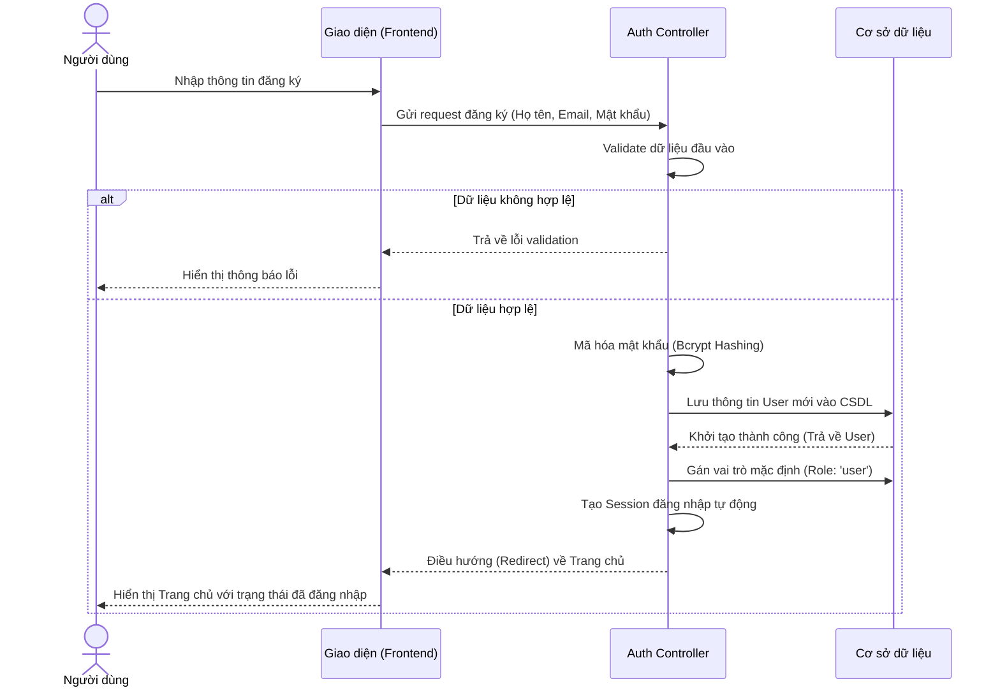
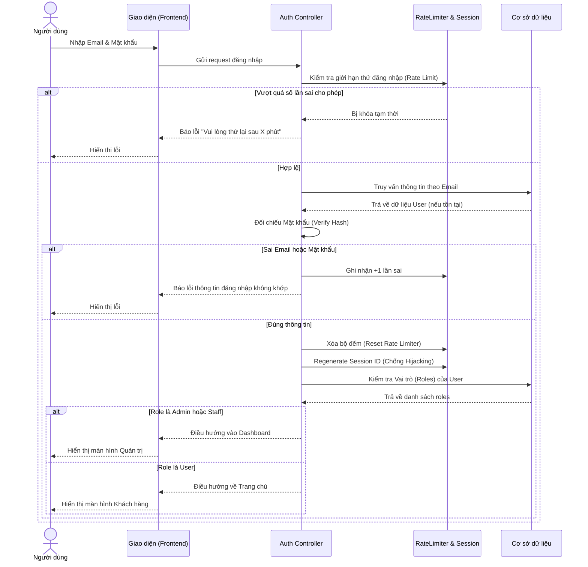
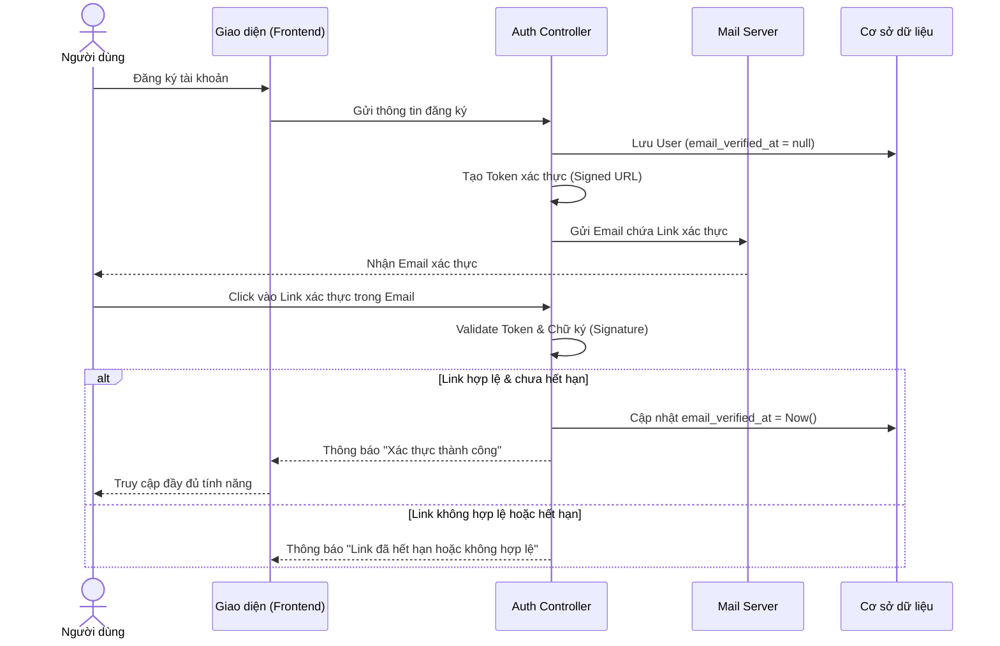
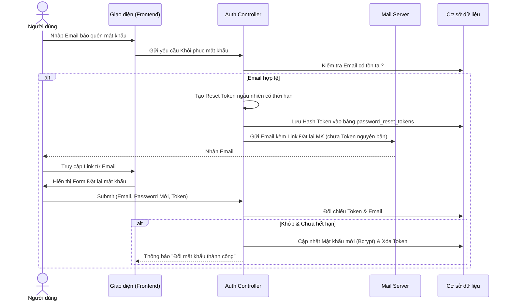
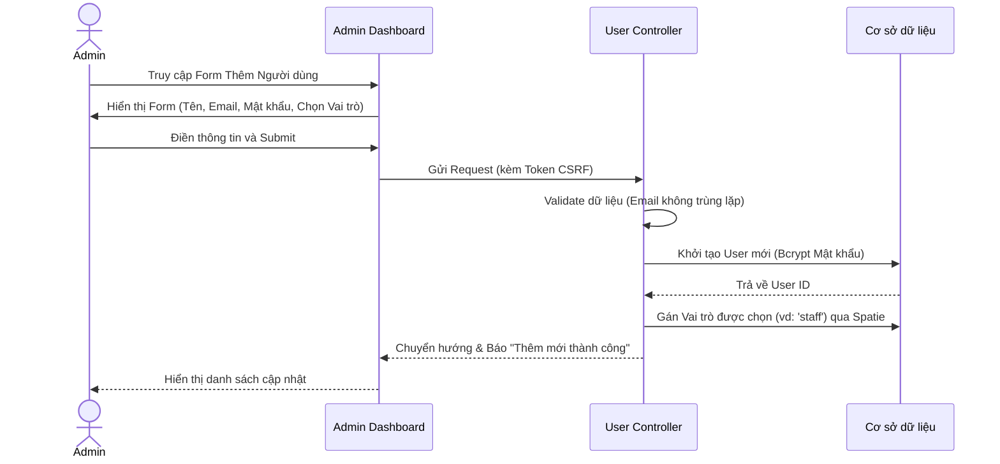
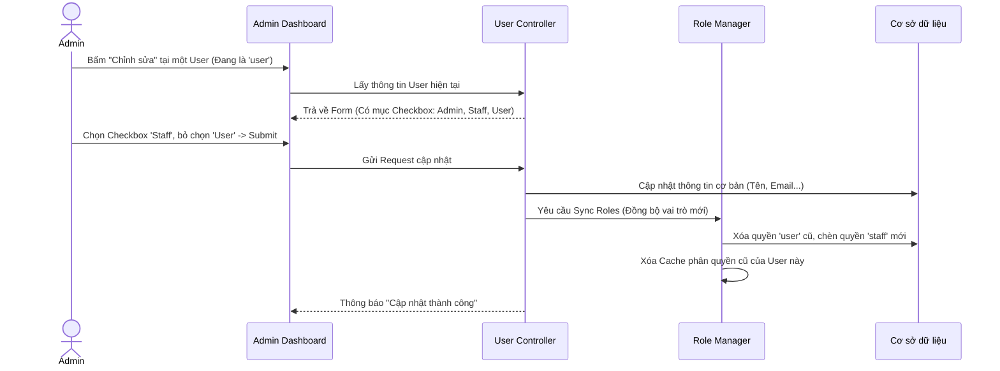

# TÀI LIỆU PHÂN TÍCH NGHIỆP VỤ
**Hệ thống:** Pet Adoption Management System (PetJam)
**Module:** Quản lý Tài khoản (Đăng nhập, Đăng ký), Quản lý Người dùng & Phân quyền

---

## 1. Công Nghệ Sử Dụng

Hệ thống được xây dựng trên nền tảng các công nghệ hiện đại, đảm bảo tính bảo mật, dễ mở rộng và tối ưu hiệu suất:
- **Ngôn ngữ & Framework:** PHP 8.x, Laravel Framework (phiên bản 11.x).
- **Frontend:** TailwindCSS, Alpine.js, Blade Template.
- **Cơ sở dữ liệu:** MySQL.
- **Thư viện bên thứ ba (Packages):** 
  - `spatie/laravel-permission`: Xây dựng cơ chế Role-Based Access Control (RBAC) linh hoạt.
  - Laravel Breeze / Fortify: Hỗ trợ luồng xác thực (Authentication) cốt lõi.

---

## 2. Module Quản Lý Tài Khoản (Đăng nhập, Đăng ký)

### 2.1 Luồng nghiệp vụ (Business Flow)

**1. Luồng Đăng ký (Registration Flow)**
- Người dùng truy cập trang Đăng ký -> Điền thông tin (Họ tên, Email, Mật khẩu) -> Validate dữ liệu đầu vào.
- Mật khẩu được mã hóa một chiều (Hash) trước khi lưu vào CSDL.
- Hệ thống tự động gán cho người dùng mới vai trò mặc định (thường là `user` - khách hàng).
- Tự động đăng nhập và điều hướng về Trang chủ.



**2. Luồng Đăng nhập (Login Flow)**
- Người dùng nhập Email và Mật khẩu.
- Hệ thống kiểm tra thông tin. Nếu sai quá số lần quy định sẽ tạm khóa chức năng đăng nhập (Rate Limiting).
- Đăng nhập thành công: Hệ thống tạo Session mới. Dựa vào vai trò (Role) của người dùng để điều hướng.



**3. Luồng Xác thực Email (Email Verification Flow)**
- Ngay sau khi Đăng ký, tài khoản sẽ ở trạng thái chưa xác thực (`email_verified_at = null`).
- Hệ thống gửi một Email chứa đường dẫn (Link) kèm chữ ký số (Signed URL) đến hộp thư của người dùng.
- Người dùng click vào đường dẫn để xác thực quyền sở hữu Email.



**4. Luồng Khôi phục Mật khẩu (Password Reset Flow)**
- Người dùng quên mật khẩu sẽ nhập Email vào form "Quên mật khẩu".
- Hệ thống kiểm tra Email, sinh ra một Reset Token, lưu Hash của Token vào CSDL và gửi Link qua Email.
- Người dùng click vào Link, nhập mật khẩu mới. Hệ thống đối chiếu Token hợp lệ thì sẽ cập nhật mật khẩu.



**5. Đăng xuất (Logout)**
- Hủy bỏ toàn bộ Session của người dùng, xóa cookie phiên đăng nhập và điều hướng về trang chủ để đảm bảo an toàn.

### 2.2 Giải thích chi tiết các Cơ chế Bảo mật áp dụng

Hệ thống quản lý tài khoản được trang bị nhiều lớp bảo mật đa tầng, được kế thừa từ các chuẩn bảo mật quốc tế tích hợp sẵn trong framework Laravel:

**1. Cơ chế Mã hóa Mật khẩu (Bcrypt Hashing)**
- **Khái niệm:** Mật khẩu của người dùng không bao giờ được lưu trữ dưới dạng văn bản thô (plain-text) trong cơ sở dữ liệu. Thay vào đó, hệ thống sử dụng thuật toán băm (hashing) `Bcrypt`.
- **Cách thức hoạt động:** Bcrypt sẽ biến đổi mật khẩu thành một chuỗi ký tự ngẫu nhiên, không thể dịch ngược (one-way hash) và tự động đệm thêm một lượng dữ liệu ngẫu nhiên (gọi là `salt`) để mỗi mật khẩu, dù giống hệt nhau, cũng sẽ sinh ra các mã băm khác nhau.
- **Lợi ích:** Đảm bảo ngay cả khi cơ sở dữ liệu bị lộ, kẻ gian (và kể cả quản trị viên hệ thống) cũng không thể khôi phục hoặc biết được mật khẩu thực sự của người dùng. Tránh được hoàn toàn tấn công Rainbow Table.

**2. Cơ chế Phòng thủ Tấn công Brute Force (Rate Limiting)**
- **Khái niệm:** Tấn công Brute Force là khi hacker dùng bot tự động thử hàng ngàn mật khẩu khác nhau liên tục cho đến khi tìm ra mật khẩu đúng.
- **Cách thức hoạt động:** Hệ thống theo dõi tần suất gửi request đăng nhập theo địa chỉ IP hoặc Email. Nếu một người dùng nhập sai mật khẩu quá 5 lần liên tiếp trong 1 phút, hệ thống sẽ kích hoạt **Rate Limiter** (`ThrottlesLogins`) để từ chối ngay lập tức mọi request đăng nhập tiếp theo từ địa chỉ đó, và yêu cầu chờ một khoảng thời gian (ví dụ: 1 phút, 5 phút, v.v.) mới được thử lại.
- **Lợi ích:** Làm tê liệt hoàn toàn các bot hoặc phần mềm dò mật khẩu tự động, bảo vệ các tài khoản có mật khẩu dễ đoán.

**3. Cơ chế Chống Giả mạo Yêu cầu Liên trang (CSRF - Cross-Site Request Forgery Protection)**
- **Khái niệm:** Tấn công CSRF xảy ra khi hacker lừa trình duyệt của người dùng gửi các request trái phép đến hệ thống mà họ đang đăng nhập.
- **Cách thức hoạt động:** Laravel tự động tạo ra một `CSRF Token` duy nhất cho từng phiên đăng nhập của người dùng. Trên mỗi form gửi dữ liệu (như form đăng ký, đăng nhập), token này (`@csrf`) bắt buộc phải được đính kèm (dưới dạng input ẩn). Khi request được gửi lên server, middleware `VerifyCsrfToken` sẽ đối chiếu token gửi lên và token đã lưu trong Session. Nếu không khớp, request sẽ bị từ chối bằng lỗi `419 Page Expired`.
- **Lợi ích:** Đảm bảo mọi tác vụ như đăng nhập, đăng ký đều xuất phát từ chính form do hệ thống sinh ra chứ không phải từ website của bên thứ 3 giả mạo.

**4. Chống chiếm đoạt Phiên đăng nhập (Session Fixation / Hijacking Protection)**
- **Khái niệm:** Session Fixation là lỗ hổng khi hacker có thể dụ người dùng đăng nhập vào bằng một mã `Session ID` do hacker chỉ định sẵn, từ đó chiếm đoạt được quyền sau khi người dùng đăng nhập.
- **Cách thức hoạt động:** Khi người dùng cung cấp đúng thông tin đăng nhập, hệ thống lập tức tiến hành phá hủy `Session ID` cũ và tái tạo một `Session ID` mới toanh (sử dụng lệnh `session()->regenerate()`).
- **Lợi ích:** Mã Session cũ mà hacker biết sẽ trở nên vô giá trị, bảo đảm người dùng luôn có một phiên truy cập độc lập và an toàn tuyệt đối sau quá trình đăng nhập.

**5. Cơ chế Phòng chống SQL Injection và XSS (Cross-Site Scripting)**
- **SQL Injection:** Mọi thao tác truy vấn (như tìm kiếm User bằng Email lúc đăng nhập) đều được thực hiện qua **Eloquent ORM** và **PDO Parameter Binding** của Laravel. Dữ liệu đầu vào sẽ được xử lý như "tham số" chứ không bị coi là "câu lệnh SQL" để thực thi.
- **XSS Protection:** Khi trả về các thông báo lỗi Validation hoặc hiển thị thông tin người dùng lên giao diện (qua Blade Engine `{{ $data }}`), dữ liệu tự động được mã hóa an toàn (escape) bằng hàm `htmlspecialchars()`, ngăn chặn kẻ gian chèn mã độc Javascript vào ô nhập liệu như Họ tên hay Email.

**6. Cơ chế Duy trì Đăng nhập (Remember Me Token)**
- **Khái niệm:** Cho phép người dùng đánh dấu "Ghi nhớ đăng nhập" (Remember Me) trên form đăng nhập để duy trì phiên làm việc trong thời gian dài (thường là nhiều năm) kể cả khi họ đã tắt trình duyệt.
- **Cách thức hoạt động:** Nếu người dùng chọn tùy chọn này, hệ thống sẽ sinh ra một chuỗi token ngẫu nhiên và an toàn (lưu ở cột `remember_token` trong DB). Mã token này sau đó được mã hóa và lưu vào Cookie trên trình duyệt của người dùng. Ở các lần truy cập tiếp theo, nếu Session đã hết hạn, hệ thống sẽ tự động dùng Cookie này để đối chiếu với CSDL và tái tạo lại Session đăng nhập mà người dùng không cần gõ lại mật khẩu.
- **Lợi ích:** Mang lại trải nghiệm người dùng liền mạch (UX), nhưng vẫn đảm bảo an toàn vì token được mã hóa an toàn (encrypted cookie) và có thể dễ dàng bị vô hiệu hóa nếu người dùng chủ động bấm Đăng xuất hoặc đổi mật khẩu.

**7. Cơ chế Chữ ký số cho URL (Signed URLs - Dùng cho Xác thực Email)**
- **Khái niệm:** Hệ thống ngăn chặn việc làm giả đường link xác thực email bằng cách đính kèm chữ ký điện tử mã hóa dựa trên Application Key (`APP_KEY`).
- **Cách thức hoạt động:** Khi sinh link xác thực, Laravel sẽ tạo một `signature` (chữ ký băm) đính kèm vào URL cùng với thời gian hết hạn (expiration). Khi người dùng click, hệ thống tự động tính toán lại chữ ký để xem có trùng khớp không và link có bị sửa đổi hay hết hạn không.
- **Lợi ích:** Đảm bảo chỉ có chủ sở hữu email thật sự (người nhận được đường link) mới xác thực được. Người lạ không thể tự bịa ra ID để xác thực hộ người khác.

**8. Cơ chế Bảo mật Khôi phục Mật khẩu (Password Reset Token)**
- **Khái niệm:** Khi người dùng yêu cầu đổi mật khẩu, hệ thống sinh ra một Token dùng một lần có thời hạn (thường là 60 phút) để xác minh danh tính.
- **Cách thức hoạt động:** Token này khi sinh ra sẽ được băm (Hash) trước khi lưu vào bảng `password_reset_tokens` để đề phòng trường hợp CSDL bị hack, kẻ gian cũng không thể dùng token này đi reset mật khẩu của người dùng. Mỗi token chỉ dùng được 1 lần, sau khi đổi mật khẩu thành công sẽ bị hủy bỏ ngay lập tức.
- **Lợi ích:** Ngăn chặn triệt để kẻ gian chiếm đoạt tài khoản ngay cả khi rò rỉ cơ sở dữ liệu. Cơ chế tự động hết hạn giúp giảm thiểu rủi ro nếu đường link bị lộ sau một khoảng thời gian.

### 2.3 Ưu điểm và Nhược điểm
- **Ưu điểm:** Độ bảo mật rất cao nhờ kế thừa các tiêu chuẩn của Laravel; Tốc độ xử lý nhanh; Trải nghiệm (UX) tốt nhờ có chức năng "Ghi nhớ đăng nhập".
- **Nhược điểm:** Hiện tại hệ thống mới chỉ hỗ trợ xác thực bằng Email/Mật khẩu truyền thống. Có thể cải thiện trải nghiệm trong tương lai bằng cách tích hợp thêm Đăng nhập qua Mạng xã hội (Social Login: Google, Facebook).

---

## 3. Module Quản Lý Người Dùng (User Management)

### 3.1 Sơ đồ Use Case (Use Case Diagram)

Dưới đây là sơ đồ tổng quan thể hiện quyền hạn tương tác của các nhóm người dùng đối với các chức năng trong module Quản lý Người dùng và Phân quyền.

```mermaid
flowchart LR
    %% Actors
    Admin(["🧑‍💼 Admin (Quản trị viên)"])
    Staff(["👔 Staff (Nhân viên)"])
    User(["👤 User (Khách hàng)"])

    %% Usecases
    subgraph "Quản Lý Người Dùng & Phân Quyền"
        direction TB
        UC1([Xem danh sách người dùng])
        UC2([Tìm kiếm & Lọc tài khoản])
        UC3([Thêm mới Nhân sự (Staff/Admin)])
        UC4([Cập nhật thông tin tài khoản])
        UC5([Phân quyền & Đổi Role])
        UC6([Khóa / Đình chỉ tài khoản])
        UC7([Cập nhật Profile cá nhân])
    end

    %% Admin relationships
    Admin --> UC1
    Admin --> UC2
    Admin --> UC3
    Admin --> UC4
    Admin --> UC5
    Admin --> UC6
    Admin --> UC7

    %% Staff relationships
    Staff --> UC1
    Staff --> UC2
    Staff -. "Chỉ xem" .-> UC4
    Staff --> UC7

    %% User relationships
    User --> UC7
```

### 3.2 Các luồng nghiệp vụ cốt lõi (Business Flows)

**1. Luồng Xem Danh sách và Tìm kiếm (Read & Search)**
- **Nghiệp vụ:** Quản trị viên (Admin) truy cập trang Quản lý Người dùng để theo dõi toàn bộ tài khoản trên hệ thống. 
- **Chức năng:** Hệ thống hiển thị dưới dạng bảng (Table), tích hợp sẵn thanh Tìm kiếm (theo Tên, Email, Số điện thoại) và Bộ lọc (theo Vai trò: Admin, Staff, User).
- **Luồng xử lý:** Để tránh quá tải khi dữ liệu lớn, Controller chỉ lấy một số lượng bản ghi nhất định mỗi trang (Pagination) và truy vấn kèm (Eager Loading) thông tin về Vai trò (Roles) để giảm thiểu lỗi N+1 Query.

**2. Luồng Thêm mới Nhân sự (Create Staff/Admin)**
- **Nghiệp vụ:** Khách hàng (`user`) thì tự đăng ký ở ngoài frontend. Nhưng đối với nhân viên (`staff`) hoặc quản trị viên cấp dưới, Admin cấp cao phải tự tay tạo tài khoản thông qua Dashboard để đảm bảo bảo mật.
- **Luồng xử lý:**



**3. Luồng Cập nhật Thông tin và Phân quyền (Update & Assign Roles)**
- **Nghiệp vụ:** Cho phép sửa lỗi sai thông tin cá nhân. Quan trọng hơn, đây là nơi Admin có thể **Thăng cấp (Promote)** một khách hàng thành nhân viên, hoặc **Giáng cấp (Demote)** một nhân viên về làm khách hàng bình thường thông qua việc thay đổi Roles.



**4. Luồng Xóa hoặc Đình chỉ Tài khoản (Delete / Ban)**
- **Nghiệp vụ:** Xử lý các tài khoản vi phạm quy định, spam đơn nhận nuôi, hoặc nhân viên đã nghỉ việc.
- **Quy tắc (Business Constraint):** 
  - Admin không thể tự xóa chính mình.
  - Khuyến nghị sử dụng **Xóa mềm (Soft Deletes)** thay vì xóa vĩnh viễn (Hard Delete) khỏi CSDL. Việc xóa vĩnh viễn sẽ dẫn đến lỗi mất liên kết dữ liệu (Foreign Key Constraints) đối với các bảng Thú cưng, Đơn nhận nuôi, Lịch sử Ủng hộ do người dùng đó tạo ra. Khi Xóa mềm, user không thể đăng nhập, nhưng dữ liệu lịch sử vẫn được bảo lưu trên hệ thống.

### 3.2 Cơ chế kỹ thuật và Bảo mật
- **Authorization (Xác thực quyền):** Các Route CRUD của User được bảo vệ cực kỳ nghiêm ngặt. Chỉ những tài khoản đã vượt qua Middleware `auth` (đã đăng nhập) VÀ `role:admin` (là quản trị viên cấp cao) mới được phép gọi các hàm trong `UserController`. Staff thông thường không được phép tự ý thêm/sửa/xóa nhân viên khác.
- **Ngăn chặn Lỗ hổng Mass Assignment:** Trong `User Model`, chỉ những trường an toàn (name, email, password) mới được khai báo trong `$fillable`. Cột quyết định quyền hạn (`role_id` hoặc các bảng trung gian của Spatie) tuyệt đối không được gán hàng loạt (Mass Assign) từ Input của Request mà phải thông qua hàm `assignRole()`, ngăn chặn hacker cố tình truyền tham số `is_admin=1` qua Form HTML.

---

## 4. Module Phân Quyền (Roles & Permissions)

### 4.1 Luồng nghiệp vụ (RBAC - Role Based Access Control)
Thay vì kiểm tra cứng (hard-code) từng chức năng, hệ thống áp dụng cơ chế Role (Vai trò) và Permission (Quyền hạn).
- **Roles:** Khởi tạo các nhóm quyền: `admin` (Quản trị cấp cao), `staff` (Nhân viên), `user` (Khách hàng).
- **Permissions:** Định nghĩa các hành động cụ thể như `create_pets`, `edit_pets`, `manage_users`, `manage_donations`...
- **Gán quyền:** Admin gán các `permissions` cho một `role`. Sau đó, gán `role` đó cho Người dùng.

### 4.2 Giải thích cơ chế & Các thành phần
- Sử dụng package `spatie/laravel-permission` được đánh giá tốt nhất trong hệ sinh thái PHP.
- **Phía Backend (Routing/Controllers):** Sử dụng Middleware để chặn request.
  *Ví dụ:* `Route::middleware(['role:admin|staff'])->group(...)` đảm bảo chỉ có admin và nhân viên mới truy cập được các route quản trị.
- **Phía Frontend (Blade):** Sử dụng các Directive để ẩn/hiện nút bấm tùy theo quyền.
  *Ví dụ:* Nút "Trang quản trị" trên menu chỉ hiện ra với `@if(auth()->user()->isStaff())` hoặc `@role('admin')`.
- **Cơ chế Caching:** Spatie sẽ lưu (cache) toàn bộ danh sách vai trò và quyền hạn của người dùng vào bộ nhớ đệm (Cache/Redis) thay vì phải truy vấn Database ở mọi request. Khi admin thay đổi quyền, Cache sẽ tự động được xóa và cập nhật lại.

### 4.3 Ưu điểm và Nhược điểm
- **Ưu điểm:** 
  - Vô cùng linh hoạt. Có thể tạo thêm Roles và Permissions mới qua giao diện quản trị mà không cần sửa code.
  - Tối ưu hiệu năng cao do có cơ chế Caching quyền hạn ở level Framework.
  - Mã nguồn sạch sẽ, không bị rối nhờ cơ chế Policy/Gate tích hợp sâu.
- **Nhược điểm:** 
  - Nếu số lượng Permission quá chi tiết (granular), bảng điều khiển quản lý quyền có thể trở nên đồ sộ và phức tạp đối với quản trị viên vận hành.
