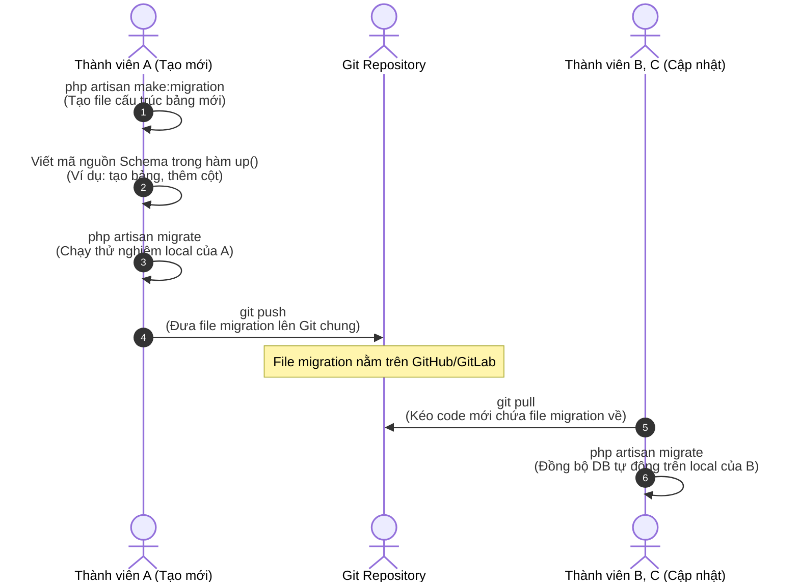

# Quy Trình Phát Triển & Đồng Bộ Database Khi Làm Việc Nhóm

Tài liệu này hướng dẫn cách phối hợp, làm việc nhóm khi có sự thay đổi về cấu trúc cơ sở dữ liệu (Database) trong dự án Laravel 12 sử dụng **Laravel Migrations** kết hợp với **Git**.

---

## 💡 Tại sao phải dùng Laravel Migration thay vì gửi file `.sql`?

Trong làm việc nhóm, việc xuất file `.sql` rồi gửi qua Zalo/Messenger/Discord để người khác import thủ công cực kỳ nguy hiểm và thiếu chuyên nghiệp:
* **Mất dữ liệu cũ:** Thành viên khác khi import file `.sql` mới có thể phải xóa bảng cũ, làm mất sạch dữ liệu test họ đã nhập.
* **Xung đột cấu trúc:** Không biết ai đã sửa cột nào, bảng nào, rất khó theo dõi lịch sử.
* **Tự động hóa bằng 0:** Mỗi lần clone code mới về lại phải đi xóa DB cũ rồi import lại từ đầu.

**Laravel Migration giải quyết triệt để vấn đề này.** Nó hoạt động như một hệ thống "Git dành cho Database". Mỗi thay đổi cấu trúc bảng sẽ là một file migration chứa mốc thời gian (timestamp). Laravel tự theo dõi file nào đã chạy, file nào chưa chạy để tự động cập nhật một cách thông minh.

---

## 🗺️ Quy Trình Phối Hợp 2 Phía



---

## 🛠️ Chi Tiết Các Bước Thực Hiện

### 1. Phía Người Tạo Thay Đổi (Thành viên A)

Giả sử bạn cần tạo một bảng mới tên là `pets` (Thú cưng):

#### Bước 1.1: Tạo file migration bằng terminal
Mở terminal tại thư mục gốc của dự án và chạy lệnh:
```bash
php artisan make:migration create_pets_table
```
*Hệ thống sẽ tạo ra một file mới tại đường dẫn `database/migrations/YYYY_MM_DD_HHMMSS_create_pets_table.php`.*

#### Bước 1.2: Định nghĩa cấu trúc bảng
Mở file vừa tạo ra và định nghĩa các cột cần thiết trong hàm `up()`:
```php
public function up(): void
{
    Schema::create('pets', function (Blueprint $table) {
        $table->id();
        $table->string('name');
        $table->string('species'); // chó, mèo, chim...
        $table->string('breed')->nullable(); // giống loài
        $table->integer('age')->nullable();
        $table->string('status')->default('available'); // trạng thái nhận nuôi
        $table->timestamps(); // tự động tạo created_at và updated_at
    });
}
```

#### Bước 1.3: Chạy thử nghiệm local
Chạy lệnh sau để kiểm tra xem file viết có bị lỗi cú pháp không và tạo bảng trong MySQL cá nhân:
```bash
php artisan migrate
```
*Đảm bảo bảng được tạo thành công trong PHPMyAdmin / MySQL Client của bạn.*

#### Bước 1.4: Push file lên Git để chia sẻ cho nhóm
Commit file migration mới này lên Git (Tuyệt đối không commit file `.sql` cá nhân):
```bash
git add database/migrations/2026_05_25_xxxxxx_create_pets_table.php
git commit -m "feat: tạo migration cho bảng pets"
git push origin <ten-nhanh>
```

---

### 2. Phía Người Nhận Cập Nhật (Thành viên B, C...)

Khi đồng nghiệp của bạn kéo code mới từ Git về máy của họ:

#### Bước 2.1: Lấy code mới chứa migration mới
```bash
git pull origin <ten-nhanh>
```

#### Bước 2.2: Đồng bộ cơ sở dữ liệu local
Chạy lệnh duy nhất sau ở terminal:
```bash
php artisan migrate
```
Laravel sẽ tự động phát hiện file migration mới mà Thành viên A vừa tạo và chạy nó để tạo bảng `pets` trên máy Thành viên B. Dữ liệu cũ trong các bảng khác (như `users`, `personal_access_tokens`...) của Thành viên B hoàn toàn không bị ảnh hưởng hay bị xóa mất.

---

## ⚠️ 3 Quy Tắc Vàng Bắt Buộc Tuân Thủ

> [!IMPORTANT]
> **Quy Tắc 1: Tuyệt đối không chỉnh sửa file migration cũ đã push lên Git**
> Nếu một file migration đã được đồng nghiệp chạy (`migrate`), bạn tuyệt đối không được sửa nội dung file đó nữa. Mọi sửa đổi trên file cũ đều vô tác dụng trên máy của đồng nghiệp vì Laravel coi như file đó đã chạy rồi.
> 
> * **Giải pháp đúng:** Nếu muốn thêm cột, sửa cột hay xóa cột của một bảng cũ, hãy tạo một file migration mới để thực hiện việc đó (Xem hướng dẫn bên dưới).

> [!WARNING]
> **Quy Tắc 2: Không chạy lệnh `migrate:fresh` trên môi trường Production (Đã chạy thực tế)**
> Lệnh `php artisan migrate:fresh` sẽ **XÓA SẠCH** toàn bộ các bảng trong database rồi chạy lại từ đầu. Lệnh này chỉ dùng ở máy cá nhân khi phát triển phần mềm (local). Dùng trên môi trường thực tế sẽ làm mất toàn bộ dữ liệu thật của khách hàng.

> [!NOTE]
> **Quy Tắc 3: Luôn khai báo đầy đủ hàm `down()` khi viết migration**
> Hàm `down()` có nhiệm vụ đảo ngược lại những gì hàm `up()` làm. Nếu hàm `up()` tạo bảng (`Schema::create`), thì hàm `down()` phải xóa bảng (`Schema::dropIfExists`). Điều này giúp chúng ta có thể rollback (quay lại trạng thái trước đó) an toàn khi gặp lỗi bằng lệnh `php artisan migrate:rollback`.

---

## 🛠️ Hướng Dẫn: Thay Đổi Cấu Trúc Bảng Đã Có

Giả sử bảng `pets` đã được tạo và đẩy lên Git. Bây giờ bạn muốn **thêm cột `color` (màu sắc)** vào bảng này.

#### Bước 1: Tạo file migration mới chỉ định bảng cần sửa
Chạy lệnh với tham số `--table`:
```bash
php artisan make:migration add_color_to_pets_table --table=pets
```

#### Bước 2: Viết mã nguồn thêm cột
Mở file mới tạo và viết:
```php
public function up(): void
{
    Schema::table('pets', function (Blueprint $table) {
        // Thêm cột color, kiểu string, cho phép rỗng, nằm sau cột name
        $table->string('color')->nullable()->after('name'); 
    });
}

public function down(): void
{
    Schema::table('pets', function (Blueprint $table) {
        // Định nghĩa hành động rollback: xóa cột color
        $table->dropColumn('color');
    });
}
```

#### Bước 3: Chạy lệnh cập nhật
```bash
php artisan migrate
```
Sau đó commit và push file này lên Git bình thường. Thành viên khác chỉ việc `git pull` và chạy `php artisan migrate` là bảng `pets` trên máy họ tự động có thêm cột `color` ngay lập tức!
