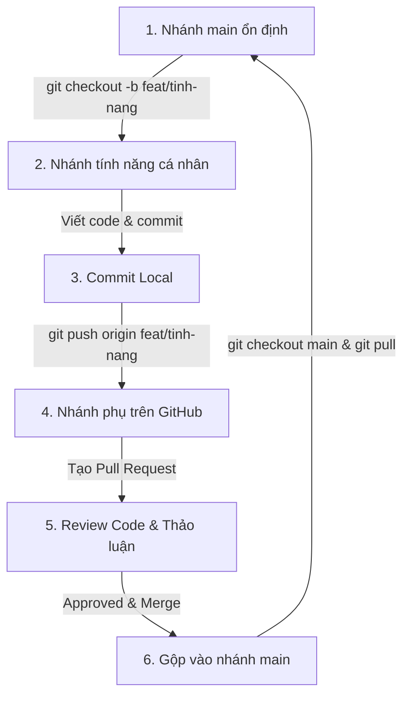

# Quy Trình Làm Việc Với Git & GitHub (Git Workflow)

Tài liệu này định nghĩa quy trình chuẩn để cả nhóm cùng phối hợp code trên **GitHub** một cách chuyên nghiệp, tránh xung đột code (conflict), mất code hoặc đè code của nhau trong dự án.

Dự án của chúng ta áp dụng mô hình **Feature Branch Workflow** (Mỗi người làm một nhánh tính năng riêng, sau đó kiểm tra rồi mới gộp vào nhánh chính).

---

## 🗺️ Sơ Đồ Luồng Làm Việc (Git Workflow)



---

## 🛠️ Quy Trình 6 Bước Làm Việc Chuẩn Hàng Ngày

Khi bắt đầu làm bất kỳ chức năng mới nào, hãy tuân thủ nghiêm ngặt 6 bước sau:

### Bước 1: Cập nhật code mới nhất từ nhánh chính (`main`)
Trước khi viết bất kỳ dòng code nào, bạn phải đảm bảo code ở máy mình là mới nhất:
```bash
# Chuyển về nhánh main
git checkout main

# Kéo code mới nhất từ GitHub về máy
git pull origin main
```

### Bước 2: Tạo nhánh mới để làm tính năng mới
Tuyệt đối **KHÔNG** code trực tiếp trên nhánh `main`. Hãy tạo một nhánh riêng cho tính năng bạn sắp làm:
```bash
# Tạo và chuyển sang nhánh mới
git checkout -b <loai-nhanh>/<ten-tinh-nang>
```
*(Xem quy tắc đặt tên nhánh ở mục bên dưới).*

### Bước 3: Code và Commit cục bộ (Local)
Trong quá trình code, hãy chia nhỏ các lần commit để dễ quản lý. Không nên gom toàn bộ chức năng lớn vào một commit duy nhất.
```bash
# Kiểm tra các file đã thay đổi
git status

# Thêm các file đã chỉnh sửa vào hàng chờ commit
git add .

# Tạo commit với thông điệp rõ ràng
git commit -m "<loai-commit>: mô tả ngắn gọn bằng tiếng Việt"
```
*(Xem quy tắc viết thông điệp commit ở mục bên dưới).*

### Bước 4: Đẩy nhánh tính năng lên GitHub
Khi tính năng đã hoàn thành và chạy thử ổn định ở máy local của bạn, hãy push nhánh này lên GitHub:
```bash
git push origin <loai-nhanh>/<ten-tinh-nang>
```

### Bước 5: Tạo Pull Request (PR) trên GitHub
1. Truy cập vào trang GitHub của dự án.
2. Bạn sẽ thấy một thông báo màu vàng gợi ý tạo Pull Request cho nhánh vừa push, bấm nút **"Compare & pull request"**.
3. **Mô tả PR:** Viết ngắn gọn những gì bạn đã làm trong PR này (Ví dụ: *"Đã hoàn thành giao diện đăng nhập, thêm nút thoát và kiểm tra xác thực"*).
4. Chỉ định thành viên khác trong nhóm làm **Reviewer** (Người duyệt code) để họ kiểm tra chéo code của bạn.

### Bước 6: Merge PR vào nhánh `main` và dọn dẹp
1. Sau khi thành viên khác kiểm duyệt và xác nhận code không bị lỗi (Approved), tiến hành **Merge Pull Request** trên giao diện GitHub.
2. Xóa nhánh tính năng đó trên GitHub (bấm nút **"Delete branch"** ngay tại trang PR).
3. Ở máy local của bạn, chuyển lại về nhánh `main` và cập nhật code mới vừa được gộp về:
   ```bash
   git checkout main
   git pull origin main
   ```

---

## 🏷️ Quy Tắc Đặt Tên Nhánh (Branch Naming)

Tên nhánh viết thường không dấu, dùng dấu gạch ngang `-` để phân tách các từ, và bắt đầu bằng tiền tố phân loại:

| Tiền tố nhánh | Ý nghĩa | Ví dụ |
| :--- | :--- | :--- |
| `feat/` | Phát triển chức năng mới | `feat/login-auth`, `feat/pet-list` |
| `fix/` | Sửa lỗi (bug) | `fix/broken-logout-button`, `fix/db-migration` |
| `docs/` | Viết hoặc cập nhật tài liệu | `docs/update-readme`, `docs/team-workflow` |
| `refactor/` | Tối ưu, viết lại code cũ (không đổi tính năng) | `refactor/clean-controllers` |
| `style/` | Chỉnh sửa CSS, giao diện (không đổi logic code) | `style/sidebar-layout` |

---

## 💬 Quy Tắc Viết Commit Message (Conventional Commits)

Để lịch sử Git của dự án trông sạch đẹp và dễ đọc, hãy viết commit message theo cấu trúc sau:
```
<loai-commit>: <Mô tả ngắn gọn hành động đã làm>
```

### Các loại commit phổ biến:
* **`feat`**: Thêm một tính năng mới.
  * *Ví dụ:* `feat: thêm chức năng lọc thú cưng theo độ tuổi`
* **`fix`**: Sửa lỗi.
  * *Ví dụ:* `fix: sửa lỗi không nhận session khi đăng nhập bằng Chrome`
* **`docs`**: Chỉ thay đổi tài liệu (file `.md`).
  * *Ví dụ:* `docs: thêm hướng dẫn git workflow cho nhóm`
* **`style`**: Thay đổi CSS, định dạng code (khoảng trắng, dấu chấm phẩy) không ảnh hưởng tới logic code.
  * *Ví dụ:* `style: sửa màu nút thoát trong sidebar sang màu đỏ`
* **`refactor`**: Thay đổi code nhưng không sửa lỗi cũng không thêm tính năng (tái cấu trúc code gọn hơn).
  * *Ví dụ:* `refactor: tối ưu hàm lấy danh sách thú cưng trong Controller`
* **`chore`**: Những việc lặt vặt khác như cài đặt package, cập nhật file `.gitignore` hoặc cấu hình dự án.
  * *Ví dụ:* `chore: cập nhật file gitignore để bỏ qua file log`

---

## 💥 Cách Xử Lý Khi Bị Xung Đột Code (Resolve Merge Conflicts)

Xung đột code (Conflict) xảy ra khi **bạn và một thành viên khác cùng chỉnh sửa trên một dòng của cùng một file** và gộp lại với nhau. Git sẽ không biết nên lấy đoạn code của ai và sẽ báo đỏ.

### Cách xử lý an toàn nhất:

1. **Khi bạn đang ở nhánh tính năng cá nhân và muốn cập nhật code mới nhất từ `main`:**
   ```bash
   git checkout main
   git pull origin main
   git checkout <nhanh-cua-ban>
   git merge main
   ```
2. Nếu có xung đột, terminal sẽ báo: `CONFLICT (content): Merge conflict in <ten-file-bi-conflict>`.
3. Mở file bị báo lỗi bằng **VS Code** (hoặc IDE của bạn). Bạn sẽ thấy các vùng code bị xung đột được đánh dấu như sau:
   ```php
   <<<<<<< HEAD (Code của bạn ở máy local)
   $user->role = 'admin';
   ======= (Ranh giới)
   $user->role = 'super_admin';
   >>>>>>> main (Code mới từ nhánh main trên GitHub)
   ```
4. **Thảo luận với người cùng sửa file đó** để xem nên giữ lại đoạn code nào, bỏ đoạn nào hoặc kết hợp cả hai.
5. Sau khi quyết định, xóa các dòng đánh dấu (`<<<<<<<`, `=======`, `>>>>>>>`) và sửa lại đoạn code cho hoàn chỉnh.
6. Lưu file lại và chạy lệnh commit để kết thúc quá trình sửa conflict:
   ```bash
   git add .
   git commit -m "fix: giải quyết xung đột code với nhánh main"
   git push origin <nhanh-cua-ban>
   ```
