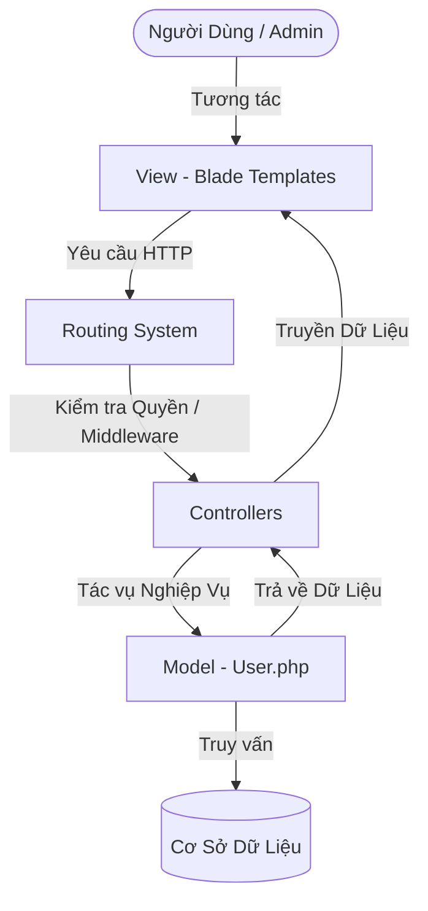

# Phân Tích Kiến Trúc Kỹ Thuật (MVC & OOP) - Laravel Breeze Profile & RBAC

Tài liệu này được biên soạn nhằm phục vụ mục đích học tập và phân tích cấu trúc của hệ thống quản lý tài khoản được xây dựng trên nền tảng **Laravel Breeze**, tích hợp cơ chế quản lý phân quyền **RBAC (Role-Based Access Control)**, tuân thủ nghiêm ngặt các nguyên lý **MVC (Model-View-Controller)** và **OOP (Object-Oriented Programming)**.

---

## 1. Cấu Trúc MVC Hoạt Động Như Thế Nào Trong Breeze & RBAC?

Laravel ứng dụng kiến trúc **MVC** để tách biệt ba thành phần chính của ứng dụng, giúp hệ thống dễ dàng mở rộng, kiểm thử và bảo trì độc lập:



### 1.1. Model (Lớp Dữ Liệu & Quy Tắc Nghiệp Vụ)
*   **Vị trí:** `app/Models/User.php`
*   **Đặc điểm OOP:** Kế thừa từ `Illuminate\Foundation\Auth\User` (Object-Relational Mapping - ORM). 
*   **Nhiệm vụ:**
    *   Đại diện cho bảng `users` trong cơ sở dữ liệu dưới dạng đối tượng (Object).
    *   Đóng gói thuộc tính phân quyền `role` (`admin`, `staff`, `user`).
    *   Đóng gói các thuộc tính và phương thức nghiệp vụ liên quan đến tài khoản người dùng dưới dạng OOP:
        ```php
        public function isAdmin(): bool
        {
            return $this->role === 'admin';
        }
        ```
    *   Tách biệt hoàn toàn khỏi việc vẽ giao diện (View).

### 1.2. Controller (Lớp Điều Hướng & Xử Lý Nghiệp Vụ Trung Gian)
*   **Vị trí:** 
    *   `app/Http/Controllers/ProfileController.php` (Thông tin cá nhân, Mật khẩu, Xóa tài khoản)
    *   `app/Http/Controllers/Admin/RoleController.php` (Quản lý phân quyền RBAC dành cho Admin)
*   **Đặc điểm OOP:** Kế thừa từ `Controller` cơ sở, ứng dụng nguyên lý **Đơn Nhiệm (Single Responsibility Principle - SRP)**.
*   **Nhiệm vụ:**
    *   `RoleController` được cô lập hoàn toàn trong không gian tên (Namespace) `App\Http\Controllers\Admin` để chỉ phục vụ quyền hạn của Quản trị viên.
    *   Nhận các yêu cầu HTTP từ Router.
    *   Phối hợp với Model để truy xuất danh sách người dùng hoặc thay đổi phân quyền.
    *   Quyết định luồng điều hướng (chuyển trang hoặc trả về view tương ứng kèm trạng thái).

### 1.3. View (Lớp Giao Diện Người Dùng)
*   **Vị trí:** `resources/views/profile/` và `resources/views/components/`
*   **Nhiệm vụ:**
    *   Chỉ chịu trách nhiệm biểu diễn dữ liệu trực quan cho người dùng.
    *   Ứng dụng cơ chế **Blade Component** hướng đối tượng (ví dụ: `<x-text-input>`, `<x-primary-button>`) giúp tái sử dụng mã nguồn và quản lý thuộc tính dạng `@props`.
    *   **Phân quyền hiển thị (Blade Directive):** Dùng câu lệnh kiểm tra điều kiện hướng đối tượng `@if(auth()->user()->isAdmin())` để hiển thị/ẩn tab quản trị viên `[04] ROLES` một cách an toàn và bảo mật ngay từ giao diện.

---

## 2. Nguyên Lý Thiết Kế OOP Áp Dụng Trong Quản Lý Tài Khoản & RBAC

Để các chức năng không ảnh hưởng lẫn nhau trong quá trình hoạt động, hệ thống áp dụng các mẫu thiết kế OOP sau:

### 2.1. Đóng Gói Xác Thực (Encapsulated Validation via Form Requests)
Thay vì viết trực tiếp logic kiểm tra dữ liệu đầu vào (Validation) bên trong Controller, Laravel ứng dụng kỹ thuật **Form Request Objects**:
*   **Vị trí:** `app/Http/Requests/ProfileUpdateRequest.php`
*   **OOP Design:** Lớp `ProfileUpdateRequest` kế thừa từ `FormRequest`, đóng gói toàn bộ quy tắc (rules) xác thực thông tin tài khoản.
*   **Ưu điểm:** Controller hoàn toàn sạch sẽ, chỉ nhận dữ liệu đã được xác thực thông qua phương thức `$request->validated()`. Nếu validation thất bại, luồng xử lý tự động ngắt và trả về lỗi mà không chạy vào logic xử lý cơ sở dữ liệu của Controller.

### 2.2. Phân Tách Tuyệt Đối & Bảo Mật RBAC (Function Isolation & Security)
Mỗi chức năng quản lý tài khoản và phân quyền hoạt động trong một "không gian hộp cát" riêng biệt:

1.  **Cập Nhật Thông Tin Cá Nhân (Name, Email):**
    *   **Endpoint:** `PATCH /profile` -> `ProfileController@update`
    *   **Request Object:** `ProfileUpdateRequest`
    *   **Tác động:** Chỉ cập nhật các trường được định nghĩa, làm sạch trạng thái xác minh email (`email_verified_at = null`) nếu email thay đổi.

2.  **Đổi Mật Khẩu (Security):**
    *   **Endpoint:** `PUT /password` -> `Auth\PasswordController@update`
    *   **Tác động:** Xác minh mật khẩu hiện tại, mã hóa mật khẩu mới (`Hash::make`), lưu trữ. Không chạm vào tên hoặc email của người dùng.

3.  **Xóa Tài Khoản (Account Termination):**
    *   **Endpoint:** `DELETE /profile` -> `ProfileController@destroy`
    *   **Tác động:** Đăng xuất phiên làm việc (`Auth::logout()`), xóa thực thể người dùng (`$user->delete()`), vô hiệu hóa Session hiện tại và làm mới Token chống giả mạo (`CSRF Token`).

4.  **Thay Đổi Quyền Hạn (RBAC Role Management):**
    *   **Endpoint:** `PATCH /admin/users/{user}/role` -> `Admin\RoleController@update`
    *   **Bảo vệ:** Xác thực người dùng thực hiện có quyền `admin` (`$request->user()->isAdmin()`).
    *   **Tác động:** Thay đổi giá trị trường `role` của user mục tiêu thành `admin`, `staff`, hoặc `user`.

> [!TIP]
> **Nguyên lý Đơn Nhiệm:** Khi bạn thay đổi mật khẩu và gặp lỗi nhập sai mật khẩu cũ, lỗi này chỉ hiển thị trong túi lỗi (`$errors->updatePassword`). Giao diện cá nhân hoặc xóa tài khoản vẫn giữ nguyên trạng thái hoạt động bình thường, không gây ra bất kỳ tác dụng phụ (side-effects) nào lên các vùng nhớ khác.
